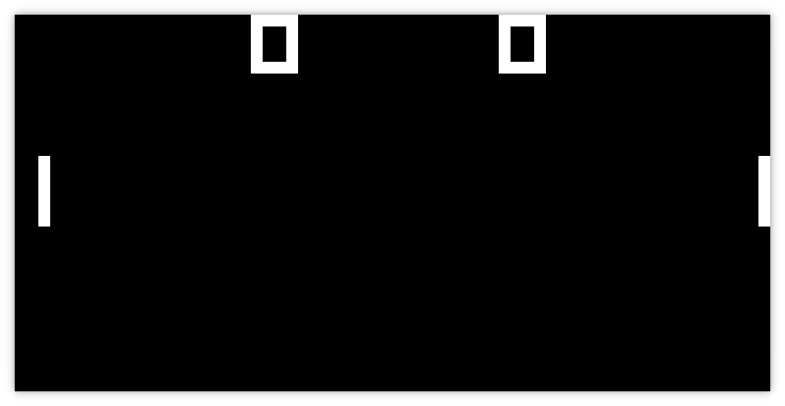

# Chip-8 Emulator
An emulator for Chip-8 interpreter written in rust  
For more information visit [Chip-8 wiki page](https://en.wikipedia.org/wiki/CHIP-8)

## TODO
- [X] Playing sounds  
- [ ] Disassembler
- [ ] Assembly compiler

## ROMs
pong.ch8: https://github.com/JamesGriffin/CHIP-8-Emulator  
test_opcode.ch8: https://github.com/corax89/chip8-test-rom
